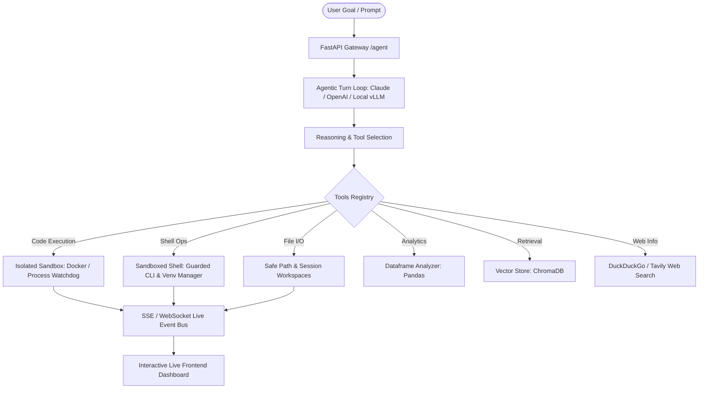

# ASTRA (DocuAgent) — Autonomous Frontier Agent & Sandboxed Tool-Use Runtime

ASTRA is a modular, high-performance autonomous agent runtime built on top of an intelligent tool-dispatch loop and an isolated execution sandbox.

Instead of answering solely from static context, ASTRA reasons, plans, executes code in secure sandboxes, manipulates files across isolated sessions, analyzes tabular data, executes shell commands with security guards, retrieves semantic knowledge from vector stores, and searches the web — streaming every step live to an interactive glassmorphism UI.



---

## What Has Been Built So Far (Phase 1: Sandboxing & Execution Security)

- **Dual-Backend Execution Sandbox (`agent/sandbox.py`)**:
  - `DockerSandbox`: Ephemeral containers with `--memory=512m`, `--cpus=1.0`, and network isolation flags.
  - `ProcessSandbox`: Hardened local execution engine with environment variable sanitization (preventing secret leakage).
  - `SandboxManager`: Auto-detects Docker daemon health and gracefully falls back to `ProcessSandbox` with metadata tagging.
- **Process Watchdog & Child Tree Termination**:
  - Cross-platform process tree killer (`ProcessWatchdog.kill_process_tree`) terminating stubborn background processes on timeouts (using `taskkill /F /T` on Windows and `SIGKILL` on Linux).
- **Workspace Virtual Environment Manager (`VenvManager`)**:
  - Provisions and manages isolated `.venv` directories inside workspaces.
  - `install_package` tool installs required pip dependencies without polluting host Python packages.
- **Sandboxed Shell Tool (`run_shell`)**:
  - Runs terminal commands strictly inside the workspace.
  - Intercepts and blocks dangerous system destruction patterns (`rm -rf /`, `format`, `del /f /s /q c:\`, fork bombs, system shutdown).
- **Strict Safe Path Resolution & Session Isolation**:
  - Blocks path traversal (`../`) and null-byte injection attacks.
  - Automatically isolates runs into `agent_workspace/sessions/{session_id}/`.
- **100% Automated Test Coverage**:
  - 14 automated unit and security tests in `tests/` passing cleanly.

---

## Project Layout

```
ASTRA/
├── agent/
│   ├── __init__.py
│   ├── core.py              # Agentic turn loop (Claude/OpenAI transports, SSE streaming)
│   ├── sandbox.py           # Docker & Process sandboxes, Watchdog, VenvManager
│   └── tools.py             # Tools registry (shell, python, files, dataframe, RAG, search)
├── tests/
│   ├── test_phase1_sandbox.py     # Sandbox security & path boundary tests
│   └── test_phase1_steps4_6.py    # Watchdog, run_shell, and venv isolation tests
├── agent_workspace/         # Sandboxed workspace for agent file I/O and execution
├── frontend/
│   └── index.html           # Glassmorphism UI with live transcript & file viewer
├── agent_router.py          # FastAPI routes (/agent/run, /agent/stream, /agent/workspace)
├── main.py                  # Server entry point
├── requirements.txt         # Project dependencies
├── .gitignore               # Protects .env, caches, and sandbox runs
└── .env                     # API keys (never committed to git)
```

---

## Quickstart Guide

### 1. Prerequisites
- Python 3.11, 3.12, or 3.13
- Git
- Optional: Docker Desktop (for containerized code execution)

### 2. Install Dependencies
```bash
pip install -r requirements.txt
pip install pytest
```

### 3. Configure API Keys
Edit `.env` and configure your API keys:
```env
ANTHROPIC_API_KEY=your_anthropic_key_here
OPENAI_API_KEY=your_openai_key_here
CHROMA_COLLECTION=docuagent
```

### 4. Run Automated Tests
```bash
# Run all unit, security, and watchdog tests
python -m pytest tests/ -v
```

### 5. Launch the Server with Live Reload
```bash
uvicorn main:app --reload --port 8000
```
Open **http://localhost:8000** in your browser to interact with the live demo UI.

---

## API & Endpoints

### 1. Blocking Execution (`POST /agent/run`)
Executes the goal to completion and returns the final answer with full transcript:
```bash
curl -X POST http://localhost:8000/agent/run \
  -H "Content-Type: application/json" \
  -d '{"goal": "Calculate 2**32 in python and save to power.txt"}'
```

### 2. Real-Time Streaming (`GET /agent/stream`)
Streams Server-Sent Events (SSE) live as the agent executes tool calls:
```bash
curl -N "http://localhost:8000/agent/stream?goal=Check+workspace+files+and+summarize"
```

### 3. Inspect Workspace (`GET /agent/workspace`)
Lists all files currently written inside the sandboxed workspace:
```bash
curl http://localhost:8000/agent/workspace
```

### 4. Health Check (`GET /health`)
Verifies provider keys and system status:
```bash
curl http://localhost:8000/health
```

---

## How to Create the GitHub Repo & Push

### Step 1: Create an Empty Repository on GitHub
1. Go to [github.com/new](https://github.com/new).
2. Set the **Repository name** (e.g., `ASTRA` or `astra-agent`).
3. Set visibility to **Public** or **Private**.
4. **Do NOT** check "Add a README file" or "Add .gitignore" (we already have them initialized and committed).
5. Click **Create repository**.

### Step 2: Link Remote & Push
From your project directory (`ASTRA`), run:
```powershell
# Link to your remote repo
git remote add origin https://github.com/SarojPradhan-code/<YOUR-REPO-NAME>.git

# Verify remote URL
git remote -v

# Push the main branch
git push -u origin main
```

---

## The 8-Phase Roadmap to Frontier "1000X" Capabilities

| Phase | Milestone | Status |
|---|---|---|
| **Phase 1** | **Sandbox & Execution Security** (Docker/Process, Watchdog, Venv, Guarded Shell) | **Completed** |
| **Phase 2** | **Async Engine & Event Bus** (Parallel Tool Calling, Bidirectional WebSockets, Session Store) | In Progress |
| **Phase 3** | **Synthetic Data Curation** (ReAct trajectories, error injection, ToolBench formatting) | Planned |
| **Phase 4** | **Model SFT & RLVR Fine-Tuning** (QLoRA, Axolotl/Unsloth, GRPO verifier, vLLM serving) | Planned |
| **Phase 5** | **Computer Use & Browser Automation** (Playwright, accessibility tree, visual grounding) | Planned |
| **Phase 6** | **Autonomous Software Engineering** (AST analysis, git automation, self-healing test loops) | Planned |
| **Phase 7** | **Document, Spreadsheet & Graph RAG** (Multi-sheet Excel, Hybrid BM25/Vector, NetworkX) | Planned |
| **Phase 8** | **Multi-Agent Swarms & Production Ops** (Planner/Coder/Critic swarms, OpenTelemetry, Docker Compose) | Planned |

---

## What This Repo Needs Next to Watch & Scale

1. **Watch Mode for Development**:
   - Run `uvicorn main:app --reload` for automatic backend hot-reloading on file edits.
   - Run `pytest-watch` (`ptw`) to continuously run the test suite upon code changes.
2. **Phase 2 Implementation**:
   - Refactoring `agent/core.py` to `asyncio` for parallel tool calls (e.g. running 3 web searches or test runners simultaneously).
   - Upgrading from one-way SSE to bidirectional WebSockets for real-time human-in-the-loop approvals.
